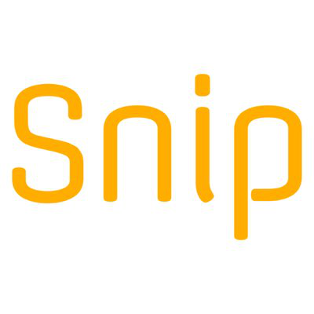
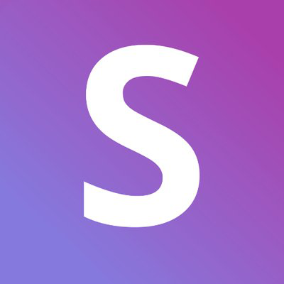
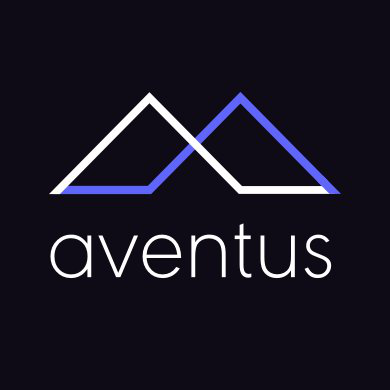
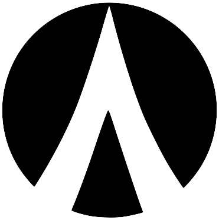
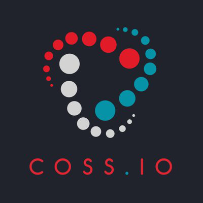
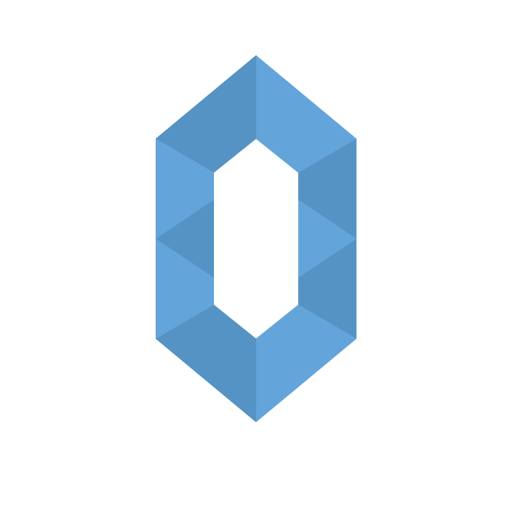
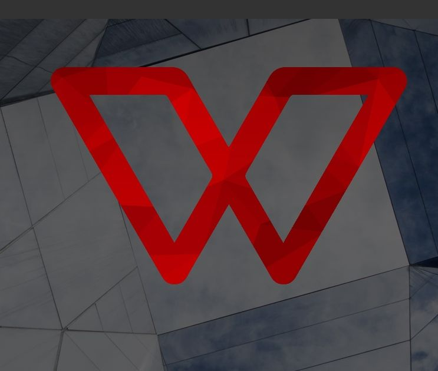
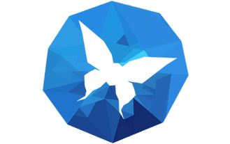
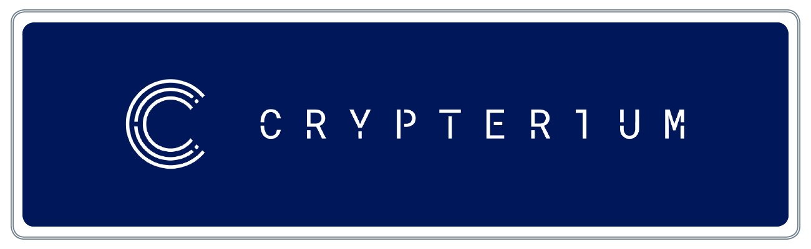
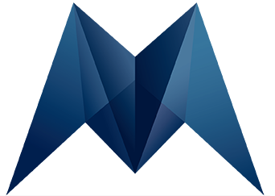

<link href="/resize.css" type="text/css" rel="stylesheet"></link>

# My portfolio 
Most of this works have been done in collaboration with my team:
* [Francesco](https://github.com/franz-ops)
* [Luigi](https://github.com/Luigi2110)

## Snip
> 
ANN link: [https://bitcointalk.org/index.php?topic=2149281](https://bitcointalk.org/index.php?topic=2149281)

## EasyMine

> 
ANN link: [https://bitcointalk.org/index.php?topic=2051790](https://bitcointalk.org/index.php?topic=2051790)   
Whitepaper: [Download](src/docs/easyMINE_Whitepaper_2.1_IT.pdf)

## Primalbase
> 
ANN link: [https://bitcointalk.org/index.php?topic=1958874](https://bitcointalk.org/index.php?topic=1958874) 

## AdEx 
> 
ANN link: [https://bitcointalk.org/index.php?topic=1986442](https://bitcointalk.org/index.php?topic=1986442)   
Whitepaper: [Download](src/docs/AdEx-Whitepaper-v1.4%20ITA.pdf)

## Snovio
> 
ANN link: [https://bitcointalk.org/index.php?topic=2203900](https://bitcointalk.org/index.php?topic=2203900) 
Bounty thread: [https://bitcointalk.org/index.php?topic=2206342](https://bitcointalk.org/index.php?topic=2206342)  
Onepager: [Download](src/docs/OnePagerIt.pdf)

## Aventus
> 
ANN link: [https://bitcointalk.org/index.php?topic=1977887](https://bitcointalk.org/index.php?topic=1977887)   
Whitepaper: [Download](src/docs/whitepaper_AVENTUS_ITA.pdf)  
Articles translated on steemit

## Unify
> 
ANN link: [https://bitcointalk.org/index.php?topic=2035612](https://bitcointalk.org/index.php?topic=2035612)

## Espers
> 
ANN link: [https://bitcointalk.org/index.php?topic=1999897](https://bitcointalk.org/index.php?topic=1999897)

## Dentacoin
> 
Whitepaper: [Download](src/docs/Whitepaper_dentacoin_ITA.pdf) 
Mainly graphic ads and whitepaper

## Trackr
> 
ANN link: [https://bitcointalk.org/index.php?topic=2018368.0](https://bitcointalk.org/index.php?topic=2018368.0)

## Coss.io
> 
ANN link: [https://bitcointalk.org/index.php?topic=2080490.0](https://bitcointalk.org/index.php?topic=2080490.0)   
Whitepaper: [Download](src/docs/coss-whitepaper-v3_ITA.pdf)

## Investfeed
> 
ANN link: [https://bitcointalk.org/index.php?topic=2080490.0](https://bitcointalk.org/index.php?topic=2042456)   
Whitepaper: [Download](src/docs/investFeedInc.pdf)

## Indorse
> 
Whitepaper: [Download](src/docs/Indorse-Whitepaper-v0.5.0.pdf)

## Wagger
> 
ANN link: [https://bitcointalk.org/index.php?topic=1941104.0](https://bitcointalk.org/index.php?topic=1941104.0)

## Blocklancer
> 
ANN link: [https://bitcointalk.org/index.php?topic=2009737](https://bitcointalk.org/index.php?topic=2009737)

## Crypterium
> 
ANN link: [https://bitcointalk.org/index.php?topic=2302242](https://bitcointalk.org/index.php?topic=2302242)

## Morpheus.Network
> 
ANN link: [https://bitcointalk.org/index.php?topic=2857832.0](https://bitcointalk.org/index.php?topic=2857832.0)

